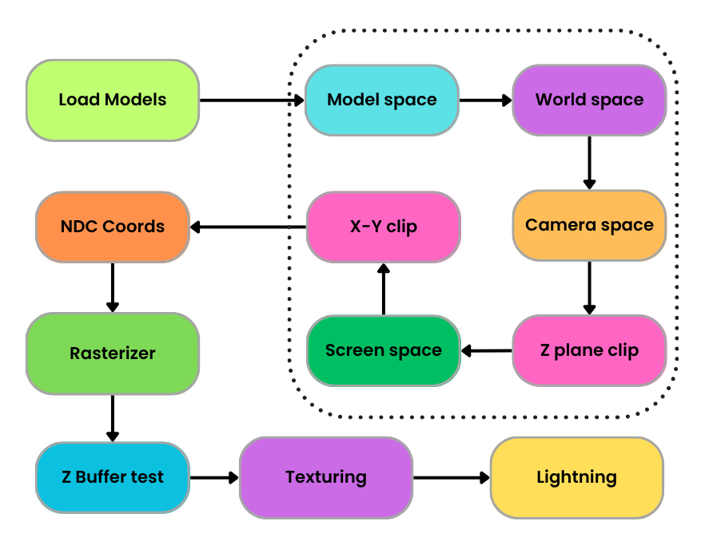

# Basic 3D Graphics Pipeline

## Build and Run
Clean all object files
```bash
./clean
```
To load the models
```bash
./run loadmodels
```
Then run the executable in this format
```bash
./run {position} {direction}
```
Example:
```bash
./run 0.0 0.0 20.0 0.0 0.0 -1.0
```
View the rendered output:
```bash
feh output.png
```


## Implementation

### Pipeline Overview



1. **Model Loading**
   - Loads `.obj` files and textures from `all_models/` directory.
   - Vertices, normals, UVs, and face indices are parsed and stored.

2. **Vertex Processing**
   - Each vertex is transformed through:
     ```
     model → world → view (camera) → clip → NDC
     ```
   - Perspective projection is handled using GLM.

3. **Clipping**
   - Liang-Barsky algorithm is used to clip triangles against the view frustum.
   - Only visible parts of geometry are rasterized.

4. **Rasterization**
   - Triangles are converted into fragments using edge functions.
   - Barycentric coordinates are used to interpolate depth, UVs, and normals.

5. **Fragment Shading**
   - Per-fragment lighting is computed using surface normals and a simple distance based light model.
   - Textures are sampled with UV perspective interpolation (Bilinear filtering).
   - Final color is written to the framebuffer.

6. **Output**
   - The framebuffer is saved as a PNG image `output.png`.

## Dependencies

- [GLM (OpenGL Mathematics)](https://github.com/g-truc/glm): For matrix/vector math and projection.
- [stb_image.h](https://github.com/nothings/stb): Header-only image loader for texture mapping.
