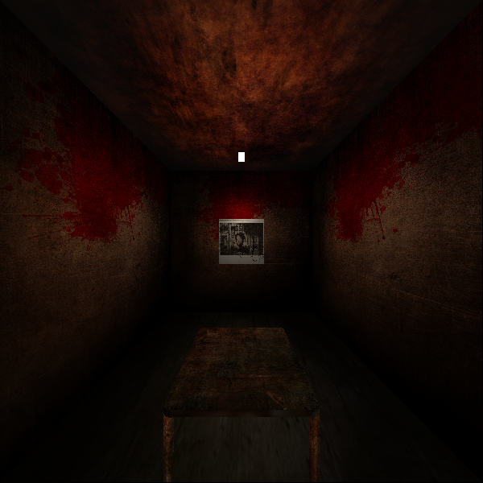

# Basic 3D Graphics Pipeline

## Build and Run
Run the executable in this format
```bash
./run {position} {direction}
```
Example:
```bash
./run 0.0 0.0 2.5 0.0 0.0 -1.0
```
View the rendered output:
```bash
feh output.png
```


## Implementation

### Features

-  **OBJ Loader**: Parses geometry, texture coordinates, and normals from `.obj` files in `all_models/`.
-  **Vertex Shader**: Transforms vertices from model space → world space → camera space → clip space.
-  **Camera System**: Custom camera transformation with configurable position and orientation.
-  **Perspective Projection**: Implemented using `glm::perspective`.
-  **Clipping**: Liang-Barsky algorithm applied in screen space to discard triangles outside the visible frustum.
-  **NDC Conversion**: Transforms clip space coordinates to normalized device coordinates (NDC).
-  **Rasterizer**: Triangle rasterization using edge functions and barycentric coordinates.
-  **Z-Buffer test**: Discards the pixel with larger z during overlap.
-  **Fragment Shader**:
  - Interpolates texture coordinates and normals per-pixel.
  - Applies Phong lighting model.
  - Supports texture mapping using `stb_image`.
-  **Texture Mapping**: Per-pixel color sampling method from loaded images.
-  **Image Output**: Final framebuffer is saved as `output.png`.

### Pipeline Overview

1. **Model Loading**
   - Loads `.obj` files and textures from `all_models/` directory.
   - Vertices, normals, UVs, and face indices are parsed and stored.

2. **Vertex Processing**
   - Each vertex is transformed through:
     ```
     model → world → view (camera) → clip → NDC
     ```
   - Perspective projection is handled using GLM.

3. **Clipping**
   - Liang-Barsky algorithm is used to clip triangles against the view frustum.
   - Only visible parts of geometry are rasterized.

4. **Rasterization**
   - Triangles are converted into fragments using edge functions.
   - Barycentric coordinates are used to interpolate depth, UVs, and normals.

5. **Fragment Shading**
   - Per-fragment lighting is computed using surface normals and a simple light model.
   - Textures are sampled with UV interpolation.
   - Final color is written to the framebuffer.

6. **Output**
   - The framebuffer is saved as a PNG image `output.png`.

## Dependencies

- [GLM (OpenGL Mathematics)](https://github.com/g-truc/glm): For matrix/vector math and projection.
- [stb_image.h](https://github.com/nothings/stb): Header-only image loader for texture mapping.
